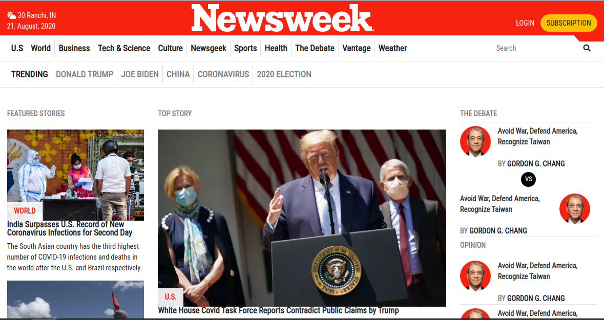

# Newsweek clone

> Newsweek clone - built using [Bootstrap](https://getbootstrap.com/) framework

## Built With

- HTML5,
- CSS3

## Live Demo

[Live Demo Link](https://raw.githack.com/harshdeepkanhai/newsweek-clone/feature/index.html)

## Author

👤 **K**

- Github: [@harshdeepkanhai](https://github.com/harshdeepkanhai)
- Twitter: [@harshdeepkanhai](https://twitter.com/harshdeepkanhai)
- Linkedin: [harshdeepkanhai](https://www.linkedin.com/in/harshdeepkanhai)

## 🤝 Contributing

Contributions, issues and feature requests are welcome!

Feel free to check the [issues page](https://github.com/harshdeepkanhai/newsweek-clone/issues).

## Show your support

Give a ⭐️ if you like this project!

## Acknowledgments

- Inspiration from the [The Next Web](https://www.newsweek.com/)
- the Odin Project

## 📝 License

This project is [MIT](lic.url) licensed.